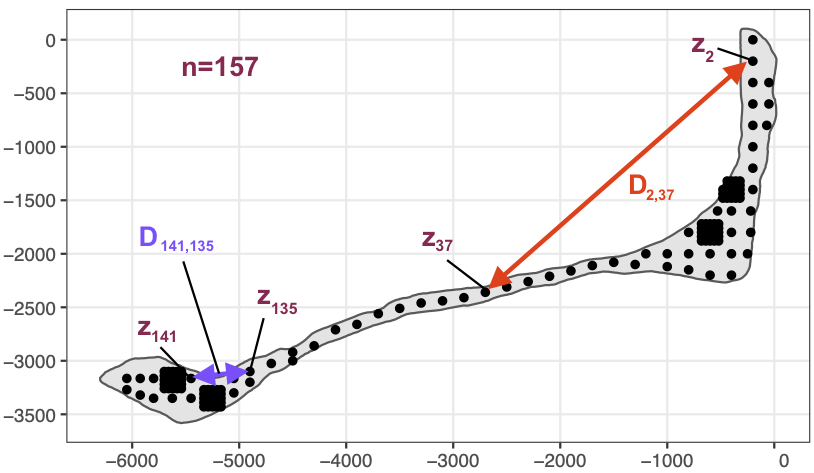

# Random fields

> "[The Force] surrounds and penetrates us. It binds the galaxy together." - Obi-Wan Kenobi

```{r import-packages, message=FALSE, results='hide'}
library( "RandomFields" )
```

A random field is like The Force - it is everywhere without being seen. Air particulate concentration, ground water level, soil lead concentration - you may be aware that these phenomena are everywhere. Sociological phenomena like public sentiment or land value may also be thought of as an ether or field that flows everywhere.

But our data doesn't surround and penetrate us; it doesn't flow through everything. Data, the observations that we actually have to work from, are quite sparse measurements of the underlying field. So our task in spatial data analysis (what makes it different from other kinds of data analysis) is generally to estimate parameters of a random field.

Here I've prepared a couple of graphics to try to connect spatial statistics to an intuition about spatial data. The reason that we always use the normal distribution for a spatial field is because it is the foremost among VERY few distributions that have a multivariate form.




```{r exponential-covariance}
# set range parameter
range = 2

# make a plot of the exponential correlation
tt = seq(0, 10, length.out=300)
cov_fun = exp( -tt / range)
plot( tt, cov_fun, type='l', bty='n', xlab="distance", ylab='correlation')

# same plot, but as a variogram
nugget = 0.2
plot( tt, 1 - cov_fun + nugget, type='l', bty='n',
      ylim = c(0, 1.3), xlab="distance", ylab='semivariance')
```


To illustrate observations from a random field, let's do a bit of simulation. I'll use the `RandomFields` package, so you'll need to install that. The `RMexp()` function uses the exponential covariance function. I'm creating four independent realizations of data so that you can see what the variability looks like.

```{r simulate-exponential-field}
# simulate six realizations with an exponential model
model <- RMexp()
x <- seq(0, 10, 0.1)
z <- RFsimulate(model, x, x, n=4)

# plot the simulations
plot( z )
```

Out of curiosity, let's see how those would look if we used another covariance function. Here I'm using cubic covariance, which is important only insofar as you can see that any effect on the data isn't obvious.

```{r simulate-cubic-field}
# The effect of the covariance model is typically not obvious:
model <- RMcubic()
z <- RFsimulate(model, x, x, n=4)
plot( z )
```

The fact that the proper covariance function is seldom obvious means that the ultimate choice often seems fairly arbitrary. This contributes to why spatial statistics is so balkanized, with dozens of very closely related methods that use incompatible language and software.