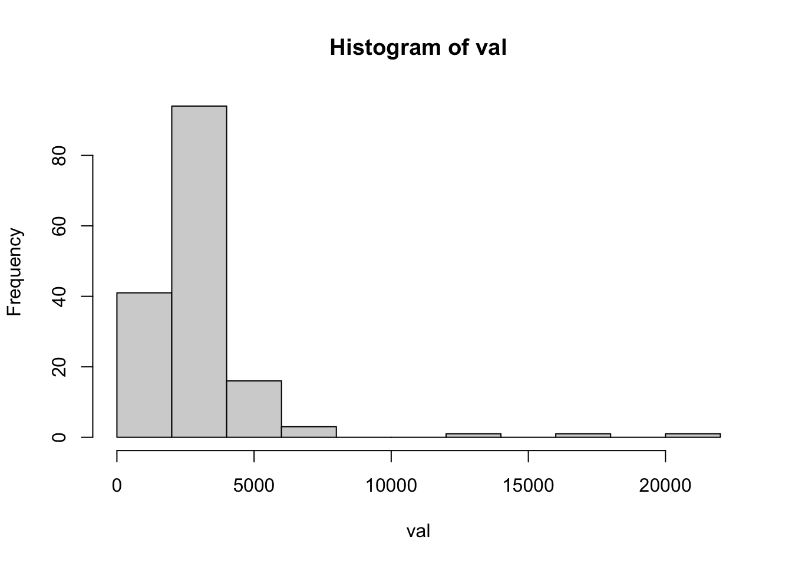
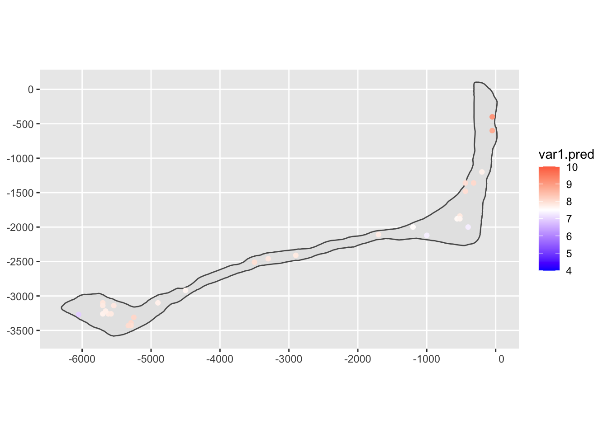
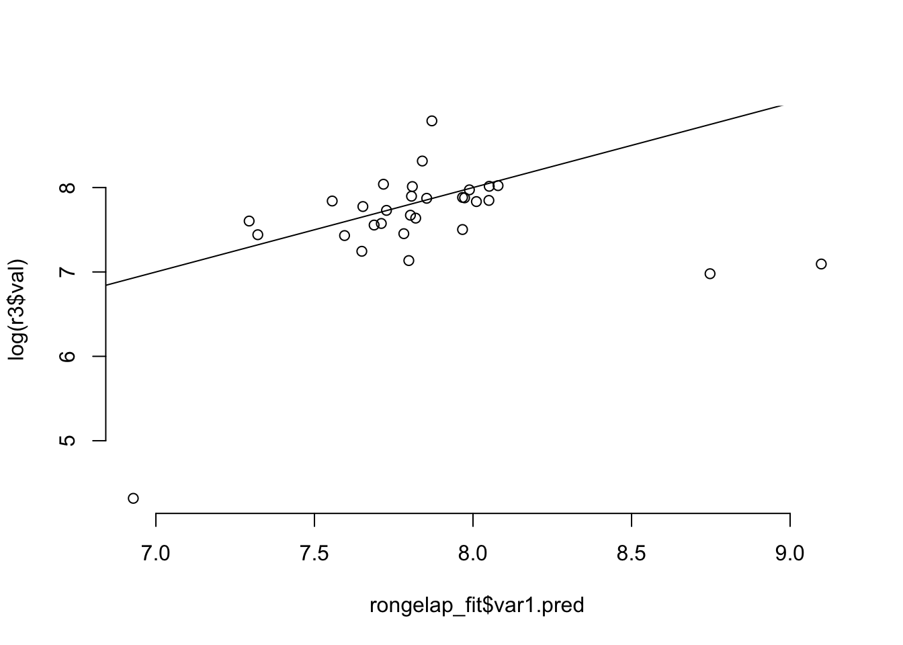
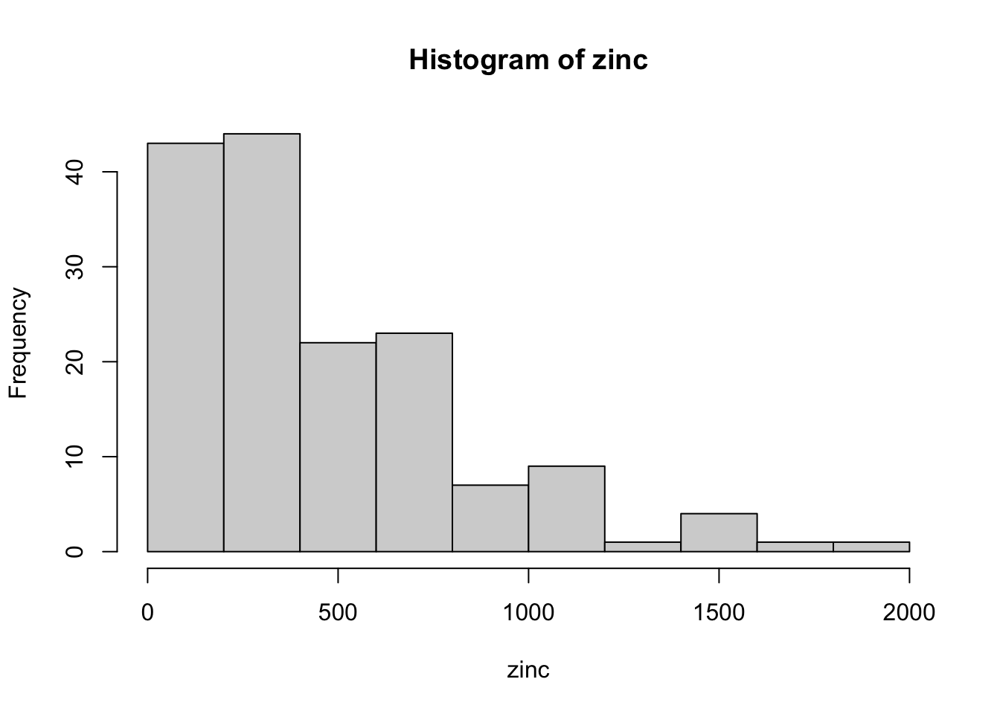
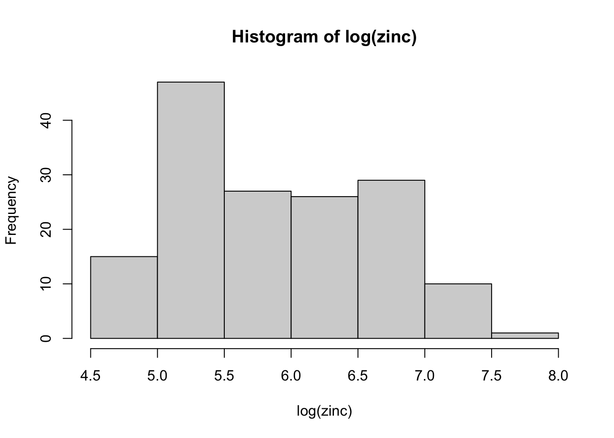
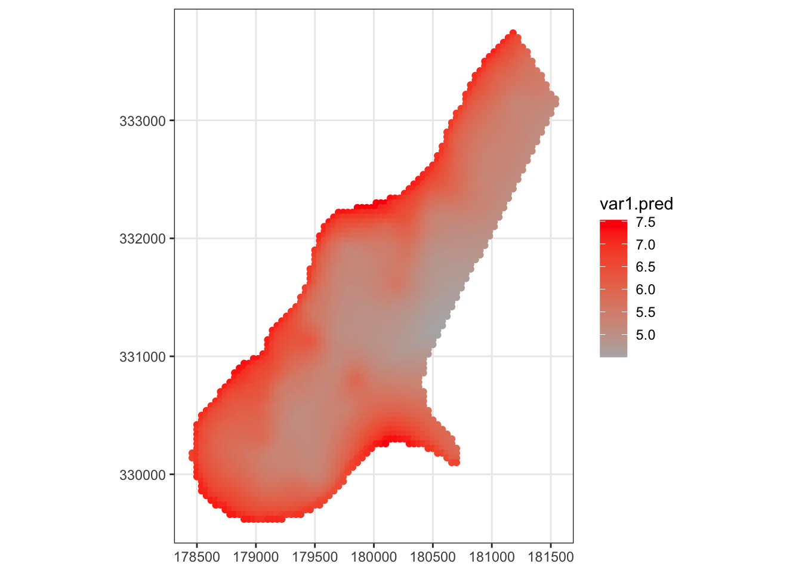
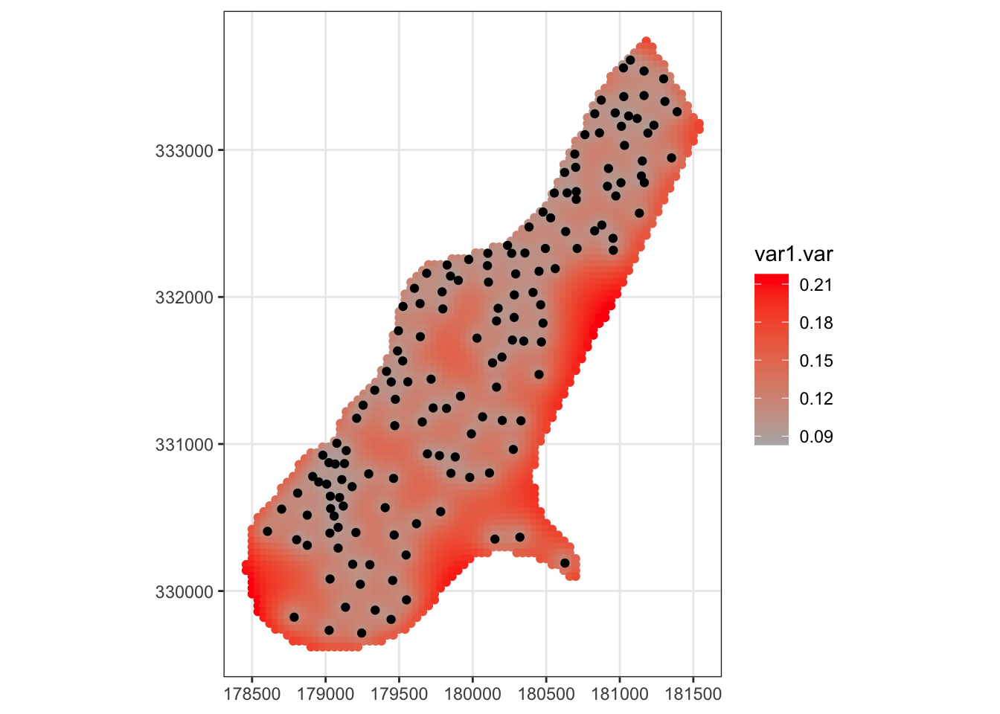

# Geostatistics


```r
library( "gstat" )
library( "stars" )
library( "readr" )
library( "ggplot2" )
```


## Example: Rongelap radiation
To illustrate basic concepts of geostatistics, I will use measurements of gamma rays on Rongelap atoll, which was irradiated by fallout in 1954 due to the Castle Bravo nuclear test at Bikini atoll, which was three times as powerful as planned. Let's load the data.


```r
# load the point data
rongelap = read_csv( url("https://raw.githubusercontent.com/ucdavisdatalab/workshop-spatial-stats/master/data/rongelap.csv") )
rongelap = st_as_sf( rongelap, coords = c('x', 'y') )

# load the outline of the island
load( url("https://github.com/ucdavisdatalab/workshop-spatial-stats/blob/master/data/rongelap-outline.rdata?raw=true") )
```

Let's check the histogram, which suggests that a log transformation will help stabilize the variance. Then plot the data over the shape of Rongelap (you've seen this already).


```r
# check the histogram to see about a log transform
with( rongelap, hist(val) )
```



```r
with( rongelap, hist( log(val) ))
```


```r
# plot the data on a two-way gradient to exaggerate differences
ggplot(rongelap_shp) +
  geom_sf() +
  geom_sf(data=rongelap, mapping=aes(color=log(val))) +
  scale_color_gradient2(limits=c(4, 10), midpoint=7.5, low="blue", high="red")
```


### Kriging
The fundamental method of geostatistical analysis is kriging (named for a South African mining engineer who invented it). To do kriging, we predict the gamma rays at unobserved locations based on a model of the field's mean and variance functions. To begin with, I'll assume the mean is constant and the variance function is exponential (which is the model we saw before).

The predictions are made at held-out locations so that we can compare them to the actual, observed values.


```r
# hold out some observations from the rongelap data set
indx = sample( 1:nrow(rongelap), 30 )
r2 = rongelap[ -indx, ]
r3 = rongelap[ indx, ]

# make a kriging model
rongelap_fit = krige(log(val) ~ 1, r2, r3, model=vgm(0.5, "Exp", 500, 0.05))
```

```
## [using ordinary kriging]
```

```r
# plot the result
ggplot(rongelap_shp) +
  geom_sf() +
  geom_sf(data=rongelap_fit, mapping=aes(color=var1.pred)) +
  scale_color_gradient2(limits=c(4, 10), midpoint=7.5, low="blue", high="red")
```



```r
# compare the fitted to the actual
plot( rongelap_fit$var1.pred, log(r3$val), bty='n' )
abline(0, 1)
```



## Example: Meuse River zinc pollution
OK, now another geostatistical data set. This time, the data are measurements of pollution in digs within a bend of the Meuse River in northern France. We will focus on zinc pollution. First thing is to load and transform the data:


```r
# load the meuse data
meuse = read_csv( url("https://raw.githubusercontent.com/ucdavisdatalab/workshop-spatial-stats/master/data/meuse.csv") )
meuse = st_as_sf( meuse, coords=c( 'x', 'y') )

# look at the zinc concentration for a possible log transform
with( meuse, hist(zinc) )
```



```r
with( meuse, hist( log(zinc) ))
```




Now let's plot the zinc concentration. It looks like the most intense pollution is along the river itself.


```r
# bubble plot of the Meuse River zinc data
ggplot(meuse) + geom_sf( mapping = aes(size=zinc), color="green", alpha=0.6)
```


### Kriging the Meuse data

Once again, we will use kriging to predict the zinc pollution in locations where no soil samples were taken. Recall that kriging estimates the random field via the mean and covariance functions. This time, rather than providing a pre-specified covariance function, I am going to estimate it. And I will estimate the mean as not constant, but as a function of distance from the river.


```r
# make a variogram of the meuse data
vario = variogram( log(zinc) ~ sqrt(dist), data=meuse )
vario_fit = fit.variogram( vario, model = vgm(1, "Exp", 900, 1))

# show the fitted variogram and its parameters:
vario_fit
```

```
##   model      psill    range
## 1   Nug 0.05712112   0.0000
## 2   Exp 0.17641525 340.3105
```

```r
plot( vario, vario_fit )
```


That's our estimated covariance function. Now let's make predictions at the locations specified in `meuse.grid` and plot them.


```r
# load the prediction locations
meuse.grid = read_csv( url("https://raw.githubusercontent.com/ucdavisdatalab/workshop-spatial-stats/master/data/meuse.grid.csv") )
meuse.grid = st_as_sf( meuse.grid, coords = c('x', 'y') )

# regression kriging for the log zinc concentration:
meuse_fit = krige( log(zinc) ~ sqrt(dist), meuse, meuse.grid, model=vario_fit)
ggplot( meuse_fit ) +
  geom_sf( mapping = aes( color=var1.pred )) +
  scale_color_gradient(low=grey(0.7), high="red") +
  theme_bw()
```



```r
# plot the uncertainty of the kriging estimator
ggplot( meuse_fit ) +
  geom_sf( mapping = aes( color=var1.var )) +
  scale_color_gradient(low=grey(0.7), high="red") +
  geom_sf(data=meuse) +
  theme_bw()
```




Note that the estimated concentration is greatest near the river, and the uncertainty of the predictions grows as you get farther away from measured data.

