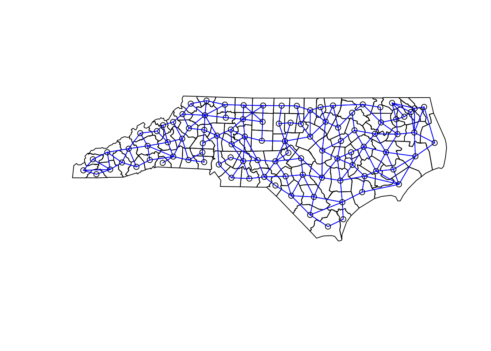

# Areal data


```r
library( "spdep" )
library( "tigris" )
library( "sf" )
library( "ggplot2" )
library( "readr" )
```

## Example: North Carolina SIDS
To illustrate some basics of areal data, we'll use data on the rate of sudden infant death in 1979 North Carolina. Here we import the data and the shapes of the counties.


```r
# import the north carolina county shapefiles
cty = counties()
nc_cty = cty[ cty$STATEFP == "37", ]
nc_cty = st_simplify( nc_cty, dTolerance=0.01 )

# import the north carolina SIDS data
nc_sids = read_csv( "data/nc_sids.csv" )
nc_sids = st_as_sf( nc_sids, coords = c("lon", "lat"), crs = "epsg:4269" )
```

Match the data to the shapes and plot the rate of SIDS:


```r
# join the shapes and data
indx = match( nc_cty$NAME, nc_sids$name )
nc_cty = cbind( nc_cty, nc_sids[indx, ] )

# calculate rate of SIDS in 1979
nc_cty = within(nc_cty, sids_rate <- SID79 / BIR79)

# plot the data
ggplot(nc_cty) +
  geom_sf(mapping = aes(fill=sids_rate)) +
  scale_fill_gradient( low=grey(0.5), high='red' ) +
  theme_bw()
```


## Neighbor weighting
While geostatistical covariance is based on the distance from points, we can't calcuate those distances for areal data because there is no unique distance between areas. For example, how far you are from Sacramento county depends on where in Yolo county you stand. So for areal data, the covariance is based on whether areas share a border. This has the added benefit of making for much faster calculations (because most areas do not touch each other). Here we'll create a neighborhood for the North Carolina counties:


```r
# make the neighborhood
nc_nb = poly2nb( nc_cty, queen=TRUE, row.names=nc_cty$NAME )

# plot the neighborhod
plot( st_geometry(nc_cty) )
plot( nc_nb, coords = st_centroid( st_geometry(nc_cty), of_largest_polygon ),
      add = TRUE, col="blue")
```

```
## Warning in st_centroid.sfc(st_geometry(nc_cty), of_largest_polygon): st_centroid
## does not give correct centroids for longitude/latitude data
```




## Moran's I
The basic test for the presence of autocorrelation between neighbors is called Moran's I and it is in the `spdep` package.


```r
# calculate neighbor weights (type W)
W = nb2listw(nc_nb)
moran.test( nc_cty$sids_rate, W )
```

```
## 
## 	Moran I test under randomisation
## 
## data:  nc_cty$sids_rate  
## weights: W    
## 
## Moran I statistic standard deviate = 1.5529, p-value = 0.06022
## alternative hypothesis: greater
## sample estimates:
## Moran I statistic       Expectation          Variance 
##       0.098926833      -0.010101010       0.004929027
```


Here, the result of `moran.test` is a p-value of 0.06, so the SIDS data are consistent with the absence of a spatial trend. When Moran's I is positive the data appear clustered, and when I is negative, the data appear dispersed.
