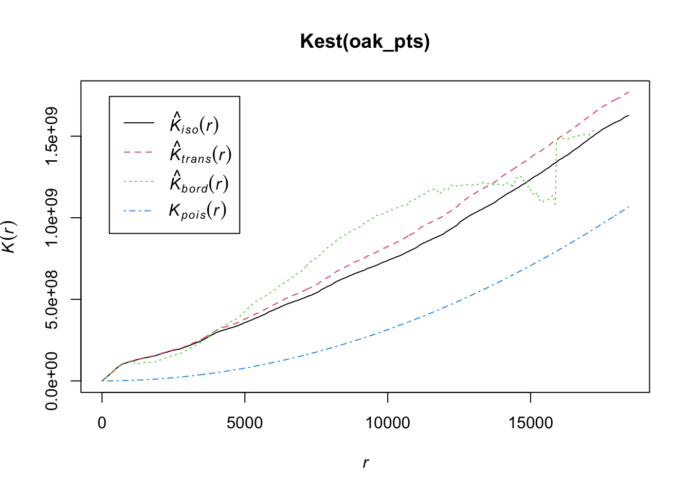
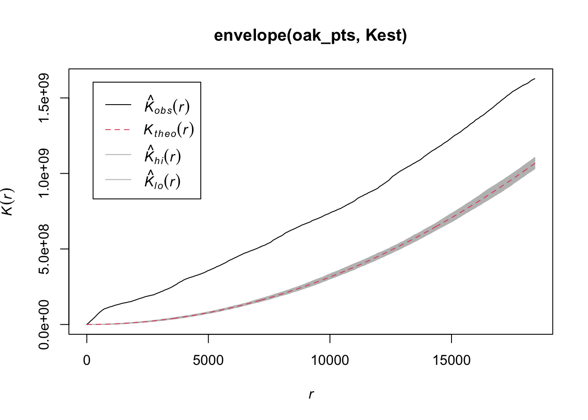

# Point processes


```r
library( "spatstat" )
library( "sf" )
library( "tigris" )
library( "dplyr" )
library( "readr" )
library( "ggplot2" )
```

## Import and plot valley oak locations
To introduce point patterns, I will use data from iNaturalist on the locations of valley oaks in Sacramento County. First, we will import the data and the Sac county shapefile.


```r
oak = read_csv( "data/oak.csv" )

# convert oak to an sf object
oak = st_as_sf( oak, coords = c("longitude", "latitude" ), crs = "epsg:4326" )

# project oaks to California Albers
oak = st_transform( oak, crs = "epsg:6414" )
```

Now, let's plot the points.


```r
# load sac county shape
cty = counties()
saccty = filter( cty, NAME == "Sacramento" )
saccty = st_transform( saccty, crs = "epsg:6414" )

# plot the oak locations in Sac county
ggplot(saccty) + geom_sf() + geom_sf(data=oak) + theme_bw()
```


## Poisson point process
The Poisson point process is a very simple point process that assumes that if you draw any square on the region, then the number of points inside the square should follow a Poisson distribution, with the expected number of points only depending on the area of the square. 

Based on the clustering of valley oaks (mostly around the American River), it looks like the number of trees would depend on the location of the square, not just its size. That would imply that this is not a simple Poisson point process. Let's back up that eye test by looking at Ripley's K function - a measure of how clustered or dispersed the points are. Either clustering or disepersion would be a violation of the Poisson assumptions. Begin by converting the point locations into a `ppp` object (`spatstat` package).


```r
# get the locations of the oaks and the bounds of the county
oak_locs = st_coordinates( oak )

# turn the oak locations into a Poisson point pattern:
oak_pts = ppp( oak_locs[, 1], oak_locs[, 2], window = as.owin( saccty ) )
```

```
## Warning: data contain duplicated points
```

## Ripley's K
Now calculate the Ripley's K function, and just for fun I'll include an estimated density showing hotspots (this density estimate is over-simple but still suggestive.)


```r
# plot the point pattern:
plot( oak_pts )
```


```r
# check whether the points follow a Poisson distribution (no)
plot( Kest( oak_pts ) )
```



```r
plot( envelope( oak_pts, Kest))
```

```
## Generating 99 simulations of CSR  ...
## 1, 2,  [etd 7:46] 3,  [etd 6:45] 4,
##  [etd 6:38] 5,  [etd 6:50] 6,  [etd 6:38] 7,  [etd 6:42] 8,
##  [etd 6:37] 9,  [etd 6:20] 10,  [etd 6:21] 11,  [etd 7:13] 12,
##  [etd 7:00] 13,  [etd 6:46] 14,  [etd 6:35] 15,  [etd 6:23] 16,
##  [etd 6:14] 17,  [etd 6:05] 18,  [etd 5:58] 19,  [etd 5:50] 20,
##  [etd 5:48] 21,  [etd 5:45] 22,  [etd 5:38] 23,  [etd 5:28] 24,
##  [etd 5:25] 25,  [etd 5:24] 26,  [etd 5:20] 27,  [etd 5:14] 28,
##  [etd 5:08] 29,  [etd 5:00] 30,  [etd 4:53] 31,  [etd 4:48] 32,
##  [etd 4:44] 33,  [etd 4:39] 34,  [etd 4:35] 35,  [etd 4:28] 36,
##  [etd 4:23] 37,  [etd 4:18] 38,  [etd 4:13] 39,  [etd 4:09] 40,
##  [etd 4:06] 41,  [etd 4:02] 42,  [etd 3:58] 43,  [etd 3:53] 44,
##  [etd 3:49] 45,  [etd 3:44] 46,  [etd 3:40] 47,  [etd 3:35] 48,
##  [etd 3:31] 49,  [etd 3:26] 50,  [etd 3:22] 51,  [etd 3:18] 52,
##  [etd 3:13] 53,  [etd 3:09] 54,  [etd 3:05] 55,  [etd 3:01] 56,
##  [etd 2:57] 57,  [etd 2:52] 58,  [etd 2:47] 59,  [etd 2:44] 60,
##  [etd 2:39] 61,  [etd 2:35] 62,  [etd 2:31] 63,  [etd 2:27] 64,
##  [etd 2:22] 65,  [etd 2:18] 66,  [etd 2:14] 67,  [etd 2:10] 68,
##  [etd 2:06] 69,  [etd 2:02] 70,  [etd 1:57] 71,  [etd 1:53] 72,
##  [etd 1:49] 73,  [etd 1:45] 74,  [etd 1:40] 75,  [etd 1:36] 76,
##  [etd 1:32] 77,  [etd 1:28] 78,  [etd 1:24] 79,  [etd 1:20] 80,
##  [etd 1:16] 81,  [etd 1:12] 82,  [etd 1:08] 83,  [etd 1:04] 84,
##  [etd 1:00] 85,  [etd 55 sec] 86,  [etd 51 sec] 87,  [etd 47 sec] 88,
##  [etd 43 sec] 89,  [etd 39 sec] 90,  [etd 35 sec] 91,  [etd 32 sec] 92,
##  [etd 28 sec] 93,  [etd 24 sec] 94,  [etd 20 sec] 95,  [etd 16 sec] 96,
##  [etd 12 sec] 97,  [etd 8 sec] 98,  [etd 4 sec]  99.
## 
## Done.
```



```r
# plot the estimated isotropic density:
plot( density( oak_pts ) )
```


The observed K-function lies entirely above the plausible envelope that would imply a simple Poisson point process. Above the theoretical K means the points are clustered (below would mean dispersed).
